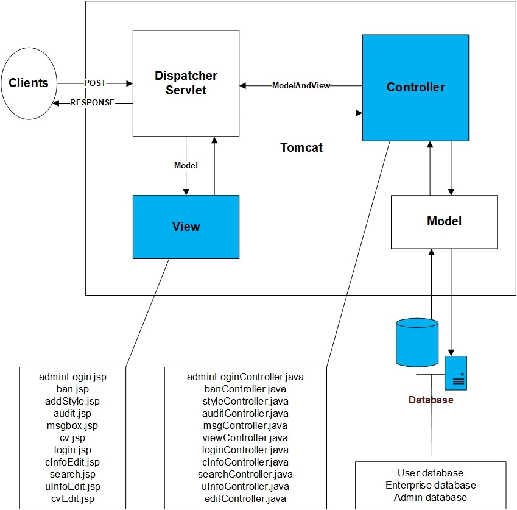
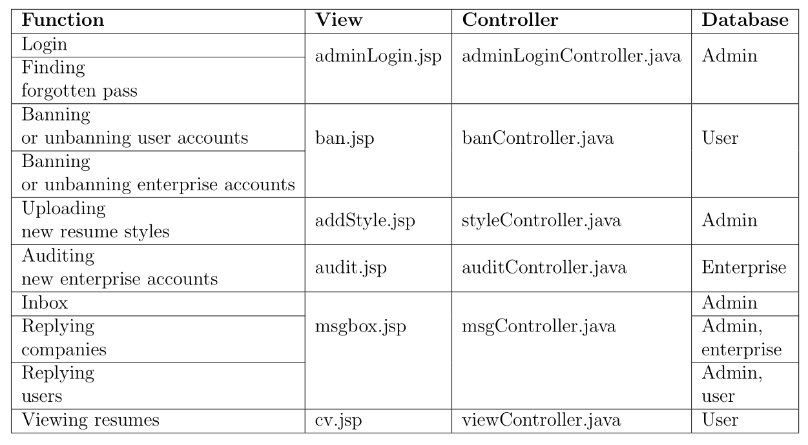
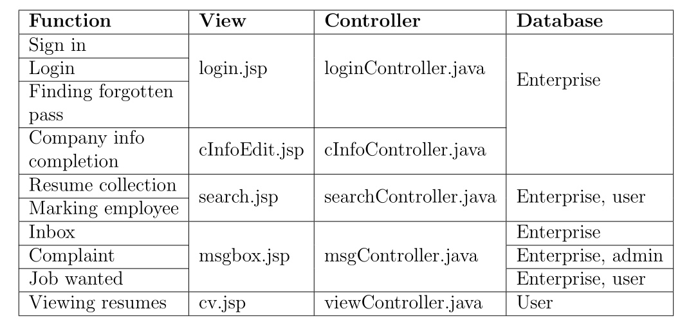
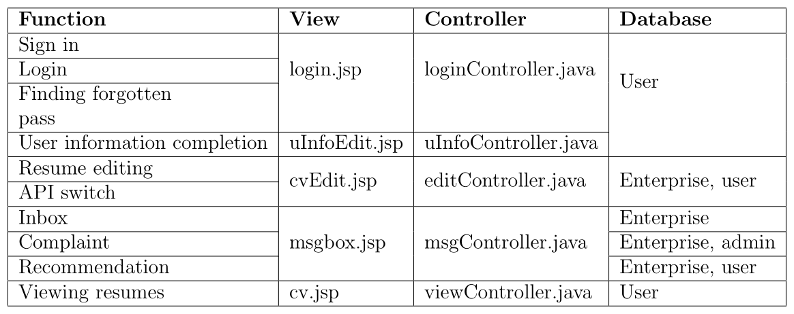
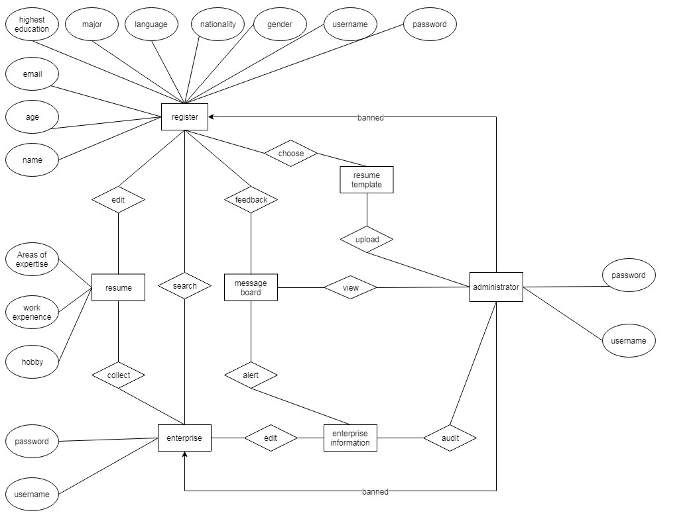

# CRROG

<!--
-->

Customised realtime resume online generator

## Environment establishment

Spring Tool Suite 4 + JDK + Apache-tomcat 9.0.33 + XAMPP;

## Build

Run XAMPP to run the phpmyadmin with MySQL;

Open STS, select a workspace and follow the operations below:

Step1: [File]->[Import]->[Maven]->[Existing Maven Projects]->[Select the source code];

Step2: [Right click the project]->[Maven]->[Update project...]->[Force Update of Snapshots/Releases]->[OK];

Step3: [Window]->[Show View]->[Other...]->[Server/Servers];

Step4: [No servers are available. Click this link to create a new server...]->[Apache/Tomcat v9.0 Server]->[Next>]->[Browse...]->[The directory where you installed Apache-tomcat 9.0.33]->[JRE:]->[Add All>>]->[Finish];

Step5: [Right click the project]->[Debug As]->[1 Debug on Server].

## MySQL

To check database structures, please refer to domain codes (`User.java` and `Company.java`);
Please set the username and password of the source code corresponding with your MySQL.

## Deployment

Please put your private key at the same path of `README.md` and update your public DNS in `.circleci/config.yml`;
Connect GitHub to CircleCI and create a building label for deployment on `README.md.`

## DEV MANUAL

### 1 Introduction

Customised Real-time Resume Online Generator (CRROG) is a web application for students of the University of Sydney (USYD) to simulate a job search platform. On the one hand, it allows people to create perfect resumes with their preferred styles. Customers can add, edit or remove resume contents in real-time to assist themselves to improve work efficiency. On the other hand, enterprise users can search for suitable staffs on our application.

This project has three roles, administrator, user, and enterprise user, including a registration interface and a resume production interface. On the registration interface, users can create personal accounts by school email. After logging into the account, users can add information, edit personalised functions and generate resumes. The information can also be modified and deleted. A variety of personalised themes can also be selected, which can help customers demonstrate their personality. The user can choose whether to start the resume to be viewed. In the process of use, users can give feedback on this project through the dashboard.

#### 1.1 Overview

Model view controller (MVC) is a typical design pattern in UI design. It decouples business logic from UIs by separating the roles of model, view, and controller in an application. Our project is a spring application based on MVC design pattern. It dedicates to help customers quickly generate their resumes. The resume can comprehensively display customer information in the form of videos, dynamic pictures, datasheets, helping customers to generate perfect resumes.

Enterprise users can register according to enterprise information. After manual examination, they can log in to the system. In the system, enterprises can search all student resumes according to keywords, assess the interviewed students, collect resumes, and score resumes. Enterprise users can also reverse our system on the dashboard.

Managers can log in the admin interface. Upload new style templates, audit users and ban users. The framework for Java programming is Spring and the framework for system architecture bases on object-relational mapping (ORM).

#### 1.2 Aims

Our project aims to enable more students to have the opportunity to have a bright and comprehensive resume and help job seekers maximise their chances of taking up new jobs.

#### 1.3 Primary user

a) Students or graduates who are too busy to design resumes;

b) Students or graduates who do not know how to design a resume, like newly graduated university students;

c) Students or graduates who are tired of typing or designing their resumes;

d) Students or graduates whose resumes are frequently updated;

e) Companies looking to recruit students from the University of Sydney;

### 2 Significances

Customised Real-time Resume Online Generator, as its name implies, is essential in its ability to be customised, real-time, automatically generated online, and user wide. In real life, the importance of personal resume is unquestionable. It says that personal resumes are used by people almost everywhere, so it is a humanised operation for users to modify their resumes in real-time and flexible.

Besides, for users who don’t know how to make a well-written resume, they can automatically generate a resume in our system by selecting a satisfactory template, which also helps them.

The above two aspects are the significant advantages of our product in terms of traditional products that require users to perform the deletion, typesetting, concerning each modification manually. Moreover, enterprise as another user who can register an account enjoys a regular and convenient operation when browsing resumes.

### 3 Project outline

#### 3.1 System architecture

We simplify the system architecture of our project based on Spring MVC framework into `Figure 1` according to Spring MVC request processing flow.

    <b>Figure 1: Simplified system architecture based on Spring MVC request processing flow</b>
    

 
The blue regions are what our work focuses on, and we do not need to care about the rest structures since they have already got integrated into the program by the framework. The view structure corresponds to JSP files in the view path of our project, while the controller part corresponds to JAVA files in the resource path of our project. Besides, we need to design our database structure adaptive for controllers.

#### 3.2 Component division

Each database mentioned in the below forms concludes the hierarchy structure of database tables. Each database table has different access for different users and orders.

##### 3.2.1 Admin component

Admin component includes functions of login, finding the forgotten pass, banning or unbanning user or enterprise accounts, uploading new resume styles, auditing new enterprise accounts, message-board, resume viewing and others. The data streams flow as Table 1. Please note that there is only one administrator without sign-in function. The admin user would receive auditing request message if any enterprise user completed or edited the company information.

    <b>Table 1: Admin component</b> 
    

##### 3.2.2 Enterprise component

Enterprise component includes functions of sign-in, login, finding the forgotten pass, company information completion, resume collection, marking employee, message-board, resume viewing and others. The data streams flow as Table 2. Please note that the enterprise user could not release job wanted or view any resume without completion of company information. Once enterprise users completed company information after registration, they would have to wait for being audited by admin. After auditing success, they would be able to use those functions.

    <b>Table 2: Enterprise component</b> 
    

##### 3.2.3 User component

User component includes functions of sign-in, login, finding the forgotten pass, user information completion, resume editing, API switch, message-board, resume view and others. The data streams flow as Table 3.

    <b>Table 3: User component</b> 
    

### 4 System data model

    <b>Figure 2: The class diagram of system data model</b>
    

 
#### 4.1 Register

a) Edit personal information;

b) Choose a resume template and edit resume;

c) Give feedback by Message-board;

#### 4.2 Enterprise

a) Edit enterprise information;

b) Collect resumes;

c) Search users;

#### 4.3 Administrator

a) Upload resume templates;

b) View Message-board (New enterprise alert or user feedback);

c) Audit enterprise information;

d) Ban user or enterprise accounts.

### 5 Conclusion

Traditional resumes do not guarantee real-time performance and designing resumes could take much time. Therefore, online real-time web resumes are launched to ensure real-time updates, and personalised styles can be selected. We are not only doing real-time resumes, but also a job search platform.

The platform has three levels of users: job seekers, enterprise users and administrators. We will realise the functions of these three-tier users, namely: the registration of job seekers and the update of the resume information, the registration of enterprise user and browsing as well as collection of the resume of the job seeker, and the admin review of the resume of the job seeker, updating resume-library and more operations.

We hope that our team can complete the design of the front-end interface associated with the above functions and the underlying implementation of the background function, and some new functions can be added by us if time permits. Moreover, after comparison with traditional resumes, this new product is expected to be able to make up for the shortcomings of traditional ones effectively.
